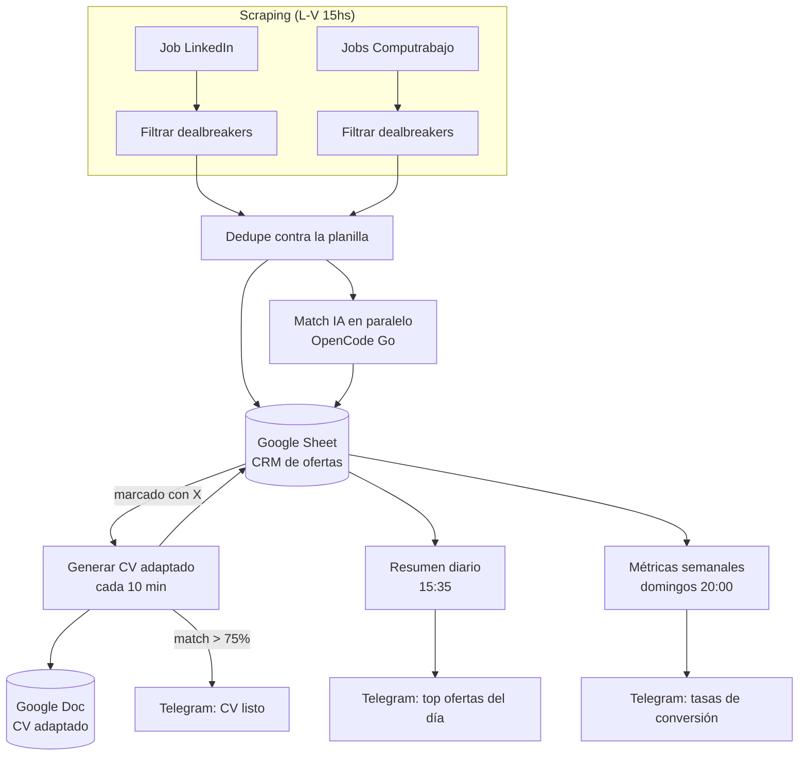

# Automatización de búsqueda laboral con n8n + IA

Sistema self-hosted que automatiza la búsqueda de empleo de punta a punta: scrapea ofertas, las filtra, les asigna un % de compatibilidad contra tu CV usando un LLM, genera un CV adaptado a cada oferta puntual, y te avisa por Telegram. Corre 100% en un VPS propio con Docker — sin depender de ningún SaaS de por medio.

## Qué hace

- **Scrapea** ofertas nuevas en LinkedIn y Computrabajo, buscando por varios perfiles/keywords en paralelo (administrativo, soporte técnico, programación).
- **Filtra** automáticamente por seniority, rubro y zona antes de guardar nada (nada de ver ofertas de 3+ años de experiencia o fuera de tu zona).
- **Guarda todo** en una Google Sheet que funciona como CRM personal: estado, fecha de detección, fecha de postulación, etc.
- **Le pide a una IA** que compare cada oferta contra tu CV y devuelva un % de match + un tip concreto de qué keyword sumar para pasar el filtro ATS.
- **Genera un CV adaptado** (Google Doc con formato real: negrita, secciones, bullets) para las ofertas que marcás manualmente, respetando una regla explícita de no inventar experiencia que no tengas.
- **Chequea anti-alucinación**: después de adaptar el CV, compara el texto generado contra tu CV base y los datos de la oferta (heurística por texto, sin gastar otra llamada a IA) y marca cualquier término que no matchee para que lo revises antes de mandarlo.
- **Te avisa por Telegram** las ofertas de alto match apenas aparecen, más un resumen diario.
- **Mide el embudo real** (no solo volumen): tasa de alto-match → postulación, postulación → entrevista, y si el CV adaptado por IA realmente correlaciona con más entrevistas — resumen semanal por Telegram.

## Arquitectura



Los 5 workflows son independientes entre sí y se coordinan únicamente a través de la Google Sheet, que actúa como base de datos compartida.

## Stack

- [n8n](https://n8n.io/) self-hosted (Docker) — orquestación, sin nodos pagos: todo el scraping y las llamadas a IA están hechos con Code nodes en JS puro (`this.helpers.httpRequest`), sin dependencias externas.
- [OpenCode Go](https://opencode.ai/docs/go/) — acceso a modelos open-source vía un endpoint compatible con la API de Anthropic, usado para el match IA y la generación de CV.
- Google Sheets + Google Docs API — CRM y generación de documentos, sin librerías adicionales (llamadas REST directas).
- Telegram Bot API — notificaciones.

## Cómo levantarlo

1. Cloná el repo y entrá a la carpeta.
2. Copiá `.env.example` a `.env` y completá tus credenciales (API key de OpenCode Go, token y chat id de Telegram).
3. Levantá n8n:
   ```bash
   docker compose up -d
   ```
4. Entrá a `http://localhost:5678` (o tu dominio) y creá tu usuario.
5. Configurá las credenciales de Google Sheets OAuth2 y Google Docs OAuth2 dentro de n8n (Settings → Credentials). Estas quedan guardadas encriptadas por n8n, nunca se exportan en los JSON de los workflows.
6. Importá los 5 workflows de `workflows/` (Workflows → Import from File).
7. En cada workflow, apuntá los nodos de Google Sheets/Docs a tu propia planilla y las credenciales que creaste en el paso 5.
8. Activá los workflows.

## Estructura del repo

```
.
├── docker-compose.yml       # n8n self-hosted
├── .env.example             # plantilla de variables de entorno (secrets van acá, no en los JSON)
├── workflows/
│   ├── job-linkedin.json            # scraping LinkedIn + match IA
│   ├── jobs-computrabajo.json       # scraping Computrabajo + match IA
│   ├── generar-cv-adaptado.json     # CV adaptado por IA + Google Doc formateado + chequeo anti-alucinación
│   ├── resumen-diario-telegram.json # resumen diario de ofertas con alto match
│   └── metricas-semanales.json      # tasas de conversión del embudo, resumen semanal
└── README.md
```

## Notas

- El scraping usa parsers propios en JS (sin dependencias) contra el HTML público de cada sitio; si cambian su markup, el nodo correspondiente empieza a devolver 0 resultados sin tirar error — es un punto conocido de mantenimiento.
- Pensado para uso personal, respetando un intervalo prudente entre requests para no generar carga sobre los sitios de origen.
- Los 3 secrets (`OPENCODE_API_KEY`, `TELEGRAM_BOT_TOKEN`, `TELEGRAM_CHAT_ID`) se leen desde variables de entorno en runtime (`$env.*` dentro de los Code nodes) — nunca están hardcodeados en los workflows exportados.
- Los workflows que escriben a la Sheet usan `Append or Update` de Google Sheets, que no es seguro ante escrituras concurrentes: si corrés dos workflows a mano al mismo tiempo (por ejemplo para testing) pueden pisarse y dejar filas en blanco. En la corrida automática programada no pasa, porque los triggers están espaciados a propósito.

## Roadmap

- Sumar más fuentes de búsqueda (Indeed, OCC) — Bumeran y Zonajobs quedaron descartados porque su API está protegida por Cloudflare Bot Management.
- Nota de personalización corta por oferta (contexto real, no genérico) antes de postularse.
- Lock compartido entre workflows para eliminar por completo el riesgo de escritura concurrente en la Sheet.

## Licencia

MIT.
